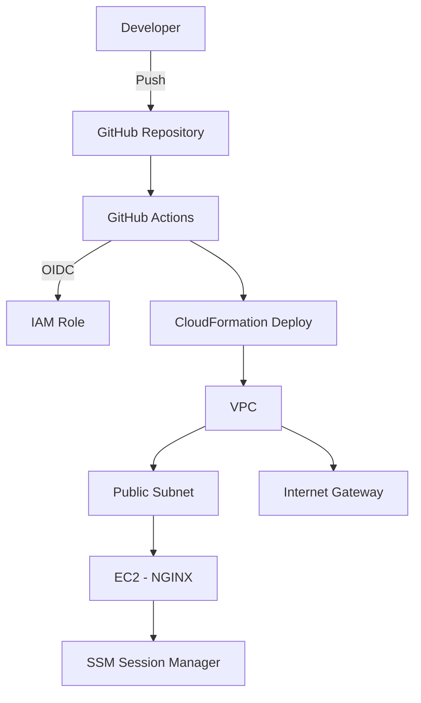

# aws-cicd-infra  
### GitHub Actions CI/CD using AWS CloudFormation

This repository demonstrates a CI/CD pipeline that validates, and deploys AWS infrastructure using CloudFormation and GitHub Actions, following infrastructure-as-code and least-privilege best practices.

The goal is to safely "validate, **deployed**, and managed" across environments using modern DevOps workflows without long-lived AWS credentials.

---

## Architecture Overview

Each environment deploys a simple AWS workload:

- **VPC** (10.20.0.0/16)
- **Public Subnet** (10.20.1.0/24)
- **Internet Gateway + Route Table**
- **Security Group**
  - HTTP (80) allowed
  - SSH optional (for lab/testing only)
- **EC2 (t3.micro)** running **NGINX**
- **IAM Role**
  - AWS Systems Manager (SSM) access (no SSH required)

This design keeps costs low while demonstrating real-world deployment patterns.

---

## CI/CD Workflow

The pipeline is implemented using **GitHub Actions** and performs the following steps:

1. Authenticate to AWS using OIDC
   - No static access keys
   - Short-lived credentials via IAM role trust
2. Validate CloudFormation templates
3. Deploy infrastructure using CloudFormation
   - Separate environments (`dev`,`prod`)
4. Track deployments using GitHub Environments


---

## Architecture Diagram



---

## Repository Structure

```text
.
├── .github/
│   └── workflows/
│       └── deploy.yml        # GitHub Actions CI/CD pipeline
├── templates/
│   └── vpc-ec2-nginx.yaml    # CloudFormation infrastructure template
├── README.md
